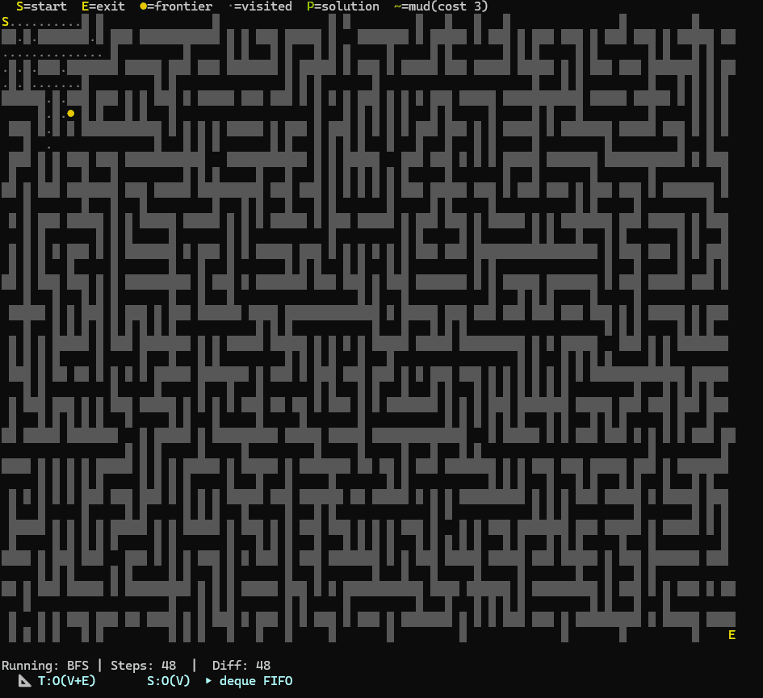
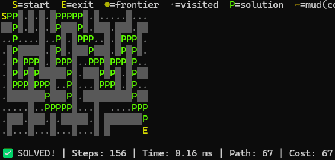

<div align="center">

# 🧩 Algorithm Encyclopedia

### An interactive terminal sandbox for learning how pathfinding algorithms actually think.

[](https://github.com/Sperfect99/Algorithm_Encyclopedia/actions/workflows/tests.yml)

[](https://python.org)
[](LICENSE)
[]()
[]()
[]()

</div>

---

## What is this?

Pick an algorithm. Watch it think. Compare it to another.

Reading about BFS and A\* is one thing. Watching BFS fan out in every direction while A\* cuts straight toward the goal — on the same maze, at the same time — is something else entirely. That's what this is for.

A terminal visualizer for 28+ classic algorithms across four problem domains, built without any external libraries. Every algorithm runs step-by-step with live colour animation, a Big-O HUD, and a post-run report card. You can replay any run frame by frame, overlay two paths on the same maze, race two algorithms side by side, or step through a run cell by cell with the Autopsy Explainer — which explains in plain language what the algorithm is deciding and why.

The goal is simple: make the *behaviour* of each algorithm visible, not just its result. Because the moment you see A\* ignore half the maze and still find the optimal path, the theory clicks in a way that a textbook diagram never quite manages.

**This project is in active development.** The algorithm core is stable and tested. The interface is functional but still evolving — making it friendlier and more intuitive is the next major focus.

---

## Demo

```
⚔️  DUEL: BFS  vs  A*

S█~  █ █   █*****█   █   █   █
*█ ███ █ █ █*█ █*███~█ ███ ███~
***█    ~█ █*█ █*****█   █   ~~
 █*█ ███████*███~███*█ ███████~
~█*    █   █*█ █ █***  █  *****
██*███████ █*█ ███*█ █████*███*
  ***********  █***█   █  *█  *
 █ █~███████████*█████████*█ █*
 █ █~  █   █~  █***  █*****█ █*
 ███~███ ███ █████*███*███████*
 █       █  ~█ █ █***█*█  *****
 █████ ███ ███ █ ███*█*███*████
     █   █ █       █*█*  █*█
████ ███ █ ███ █ █ █*█*███*███
       █       █ █ █***  █****E

──────────────────────────────────────────────────────────────
  Metric                 BFS                A*
──────────────────────────────────────────────────────────────
  Steps                  250                238
  Path Length            91                 91
  Path Cost              107                107
  Compute Time           1.92 ms           0.36 ms
──────────────────────────────────────────────────────────────
  1=BFS only (0)   2=A* only (0)   *=shared (91)
──────────────────────────────────────────────────────────────
```





## Modules

| # | Module | Algorithms |
|---|--------|-----------|
| **1** | [Classic Pathfinding](#classic-pathfinding) | BFS, DFS, A\*, Dijkstra, IDA\*, Bellman-Ford, Bidirectional BFS, Greedy, Beam Search, Bidirectional A\*, Flood Fill, Theta\*, Wall Followers, Pledge, Random Mouse, Trémaux |
| **2** | [TSP / Treasure Hunt](#tsp--treasure-hunt) | Nearest Neighbour, Brute Force (exact, N≤8), Genetic Algorithm + 2-opt |
| **3** | [MAPF](#multi-agent-pathfinding-mapf) | Independent A\*, Prioritised Planning, Conflict-Based Search (CBS) |
| **4** | [Pursuit-Evasion](#pursuit-evasion) | Naive Recalculation, Dynamic Repair (D\* Lite inspired), Greedy Intercept |

---

## Algorithms

### Classic Pathfinding

19 algorithms on procedurally generated mazes (7×15 up to 61×151). Weighted terrain — mud patches cost 3× to traverse — makes the difference between cost-aware and cost-blind algorithms immediately visible. Run BFS and Dijkstra on the same muddy maze and compare the paths.

| Algorithm | Optimal? | Cost-Aware? | Space | Notes |
|-----------|:--------:|:-----------:|-------|-------|
| BFS | ✅ hops | ❌ | O(V) | Fewest hops, ignores terrain cost |
| DFS | ❌ | ❌ | O(V) | Memory-efficient, path quality suffers |
| A\* | ✅ cost | ✅ | O(V) | f = g(cost) + h(manhattan) — heuristic swappable |
| Dijkstra | ✅ cost | ✅ | O(V) | A\* with h = 0 — expands radially |
| Greedy Best-First | ❌ | ❌ | O(V) | f = h only. Charges through mud |
| Bidirectional BFS | ≈ hops | ❌ | O(V) | Two frontiers from S and E |
| IDA\* | ✅ cost | ✅ | O(d) | A\* memory at the cost of re-expansions |
| Bellman-Ford | ✅ cost | ✅ | O(V) | Relaxes all edges per pass, O(V·E) |
| Dead-End Filling | — | — | O(V) | Topological: seals dead ends, reveals path |
| Wall Follower | ❌ | ❌ | O(1) | Right-hand rule — fails on braided mazes |
| Left-Hand Rule | ❌ | ❌ | O(1) | Mirror of Wall Follower |
| Pledge | ❌ | ❌ | O(1) | Wall follower + turn counter to escape islands |
| Random Mouse | ❌ | ❌ | O(1) | Pure random walk. Capped at 10k steps |
| Randomized DFS | ❌ | ❌ | O(V) | DFS with shuffled direction order |
| Trémaux (1882) | ✅ | ❌ | O(V) | Original chalk-mark method. Complete |
| Beam Search | ❌ | ❌ | O(k) | Fixed-width frontier — width-k pruning, may fail |
| Bidirectional A\* | ≈ cost | ✅ | O(V) | Dual A\* waves, MM-inspired stopping rule |
| Flood Fill | — | — | O(V) | Maps every reachable cell, no target |
| Theta\* | ≈ cost | ✅ | O(V) | Any-angle paths via line-of-sight shortcuts |

### TSP / Treasure Hunt

Collect all N treasure points on a live maze grid in optimal order. Distances are BFS-accurate — no straight-line shortcuts. The Genetic Algorithm animates each generation live, showing crossover and mutation happening in real time.

| Algorithm | Optimal? | Notes |
|-----------|:--------:|-------|
| Nearest Neighbour | ❌ | Greedy. Always fast, often good enough |
| Brute Force | ✅ | Exact optimal. Only enabled for N ≤ 8 (N! grows fast) |
| Genetic Algorithm | ≈ | Crossover + mutation + 2-opt polish. Animated generation by generation |

### Multi-Agent Pathfinding (MAPF)

Route 2–3 agents to individual goals without vertex collisions. The three strategies represent a real trade-off: Independent A\* is fast but produces conflicts; CBS is optimal but searches exponentially. Conflicts are highlighted live during simulation.

| Algorithm | Conflict-Free? | Optimal? | Notes |
|-----------|:--------------:|:--------:|-------|
| Independent A\* | ❌ | per agent | Plans in isolation. Conflicts shown live |
| Prioritised Planning | ✅ | suboptimal | Reserves space-time cells — fast, no backtracking |
| CBS | ✅ | ✅ SoC | Constraint tree search. Planning phase animated |

### Pursuit-Evasion

One agent chases a target that actively flees. The target moves every tick. The key comparison is replan frequency — Naive replans every single step, Dynamic Repair only when the path breaks. Watch the difference in behaviour.

| Strategy | Replan Frequency | Notes |
|----------|:----------------:|-------|
| Naive Recalculation | Every tick | Correct but expensive |
| Dynamic Repair | On path invalidation | Repairs the existing path when blocked |
| Greedy Intercept | On path invalidation | Predicts target trajectory and cuts it off |

---

## Features

**Live visualisation**
- Step-by-step animation with adjustable speed: Slow (150ms) / Normal (50ms) / Fast / Instant
- Big-O HUD — time and space complexity shown on screen during every run
- Priority Queue Inspector — live top-3 heap entries for A\*, Dijkstra, Greedy (lets you see what the algorithm is "thinking")
- Fog of War — hides unvisited cells so you only see the search frontier expanding
- Maze difficulty score — a 0–100 score based on dead ends, tortuosity, and branching shown in the HUD and report card
- Topology panel — dead-end count, junction density, branching factor, and longest corridor shown after each generation

**Comparison tools**
- **Algorithm Duel** — two paths overlaid on the same maze; shared cells, A-only cells, and B-only cells each get a distinct colour
- **Race Mode** — split-screen simultaneous replay of two algorithms on identical mazes
- **Benchmark** — all 19 algorithms timed on the same maze, sorted results table, exported to CSV with topology columns

**Post-run analysis**
- **Autopsy** — step-by-step forward/backward replay of any run (ENTER / b / jump to step N)
- **Step-by-step Explainer** — each Autopsy step shows *why* that cell was chosen: g/h/f values for A\*, distance for BFS, stack depth for DFS, direction rules for wall followers, and so on. Two levels: **Beginner** (plain language analogies) and **Advanced** (numeric state, complexity notes). Toggle between levels mid-session with `[e]` — no need to restart the replay. Split-screen on wide terminals, stacked on narrow ones.
- **Heatmap** — 256-colour exploration map with absolute visit-count tiers; the same colour always means the same visit count, so you can compare heatmaps across different algorithms
- **Report Card** — steps, compute time, path length, terrain cost, efficiency ratio, and a short explanation of the result

**A\* heuristic selector**
- Six built-in presets selectable from the menu with `[h]`:

  | # | Heuristic | Formula | Admissible? |
  |---|-----------|---------|:-----------:|
  | 1 | Manhattan | \|Δr\| + \|Δc\| | ✅ |
  | 2 | Euclidean | √(Δr² + Δc²) | ✅ |
  | 3 | Chebyshev | max(\|Δr\|, \|Δc\|) | ❌ on 4-dir grids |
  | 4 | Weighted ×1.5 | 1.5 × Manhattan | ❌ |
  | 5 | Weighted ×2.0 | 2.0 × Manhattan | ❌ |
  | 6 | Zero (Dijkstra) | h = 0 | ✅ |

- **Custom heuristic plugin** — drop a `.py` file into `custom/heuristics/` and it appears in the selector automatically. The active heuristic is shown in the info bar with its admissibility marker. The Priority Queue Inspector reflects whichever heuristic is active.

**Maze generation**
- Three generators: **DFS** (winding, high dead-end density), **Kruskal's** (uniform spanning tree), **Prim's** (more open, fewer corridors)
- Press `[g]` in any module to cycle between them; the generator name is shown in the info bar
- All four modules (Classic, TSP, MAPF, Pursuit-Evasion) support all three generators

**Classroom / learning tools**
- **Hypothesis Challenge** — before each run, predict the algorithm's behaviour; your predictions are scored afterward and tracked across the session
- **Tutorial** — data structure and complexity notes for each algorithm, accessible from the main menu
- **`--learn` flag** — simplified menu with just the 19 algorithms, tutorial, fog, and hypothesis; hides the advanced comparison modes for classroom use
- Weighted terrain (mud = 3×) makes cost-aware vs cost-blind behaviour visible without any explanation needed

**Extensibility**
- **Custom algorithm plugin** — drop a `.py` file into `custom/` and it appears in the menu automatically; `_template.py` included
- **Custom heuristic plugin** — drop a `.py` file into `custom/heuristics/`; wrong signatures are caught at session start, not mid-run
- **Maze import/export** — saves maze to disk with complexity, generator, and terrain metadata; reload in any later session
- **ASCII export** — press `[x]` in any module to save the current maze as a `.txt` file with a header showing size, generator, difficulty, and topology stats

---

## Requirements

- **Python 3.9+**
- A terminal with ANSI colour support:
  - Linux / macOS — any modern terminal works out of the box
  - Windows — **Windows Terminal** or VS Code's integrated terminal. cmd.exe won't work.
- Minimum terminal size: **80 columns × 30 rows**
- Race Mode requires **~120+ columns** (two mazes side by side)
- Step-by-step Explainer split screen requires **maze width + 50 columns**; falls back to stacked layout automatically on narrower terminals
- No pip installs. No virtual environment. Standard library only.

---

## Getting started

```bash
git clone https://github.com/Sperfect99/Algorithm_Encyclopedia.git
cd Algorithm_Encyclopedia
python _encyclopedia_launcher.py
```

Or run a single module directly:

```bash
python maze_controller.py      # Classic Pathfinding (19 algorithms)
python treasure_solver2.py     # TSP / Treasure Hunt
python multi_agent_solver.py   # MAPF
python dynamic_solver3.py      # Pursuit-Evasion
```

CLI flags:

```bash
python _encyclopedia_launcher.py --learn        # simplified menu for classroom use
python _encyclopedia_launcher.py --classic      # jump straight to Classic Pathfinding
python _encyclopedia_launcher.py --tsp          # jump straight to TSP
python _encyclopedia_launcher.py --mapf         # jump straight to MAPF
python _encyclopedia_launcher.py --pursuit      # jump straight to Pursuit-Evasion
python _encyclopedia_launcher.py --seed 42      # reproducible maze — same seed = same maze sequence
python _encyclopedia_launcher.py --seed 42 --classic
python _encyclopedia_launcher.py --check        # verify Python version, terminal size, ANSI support
python _encyclopedia_launcher.py --test         # run algorithm smoke tests and exit
python _encyclopedia_launcher.py --test-v       # verbose smoke tests
python _encyclopedia_launcher.py --test-fast    # smoke tests, skip the three slowest algorithms
python _encyclopedia_launcher.py --help         # list all flags
```

**Before the first run on a new machine:** `python _encyclopedia_launcher.py --check` verifies Python 3.9+, terminal size, and ANSI colour support. Exit code 0 = ready.

**Running the tests directly** (no TTY needed, works in CI):
```bash
python tests/smoke_tests.py          # all 19 algorithms
python tests/smoke_tests.py -v       # verbose output
python tests/smoke_tests.py --fast   # skip the three slowest algorithms
```

**CI:** every push and pull request runs the full test matrix automatically — Python 3.9–3.12 on Linux, macOS, and Windows.

**First run:** pick complexity **3 or 4**, speed **Normal**, no terrain. Start with BFS (option 1) and A\* (option 3) — run both on the same maze and then use **Duel** (option d after each run) to overlay the two paths. That single comparison shows more than an hour of reading.

---

## Project structure

```
algorithm-encyclopedia/
│
├── _encyclopedia_launcher.py     # master menu — start here
│
├── maze_controller.py            # Classic Pathfinding session loop
├── maze_views.py                 # report card, tutorial, hypothesis UI, step explainer
├── maze_modes.py                 # autopsy, duel, race, benchmark
├── maze_genV4.py                 # procedural maze generation (DFS / Kruskal's / Prim's)
│
├── treasure_solver2.py           # TSP / Treasure Hunt module
├── treasure_gen.py               # maze + treasure placement + BFS distance matrix
│
├── multi_agent_solver.py         # MAPF module
├── mapf.py                       # CBS, Independent A*, Prioritised Planning generators
│
├── dynamic_solver3.py            # Pursuit-Evasion module
├── dynamic_gen3.py               # dynamic environment + target movement
├── pursuit.py                    # pursuit strategy generators
├── tsp.py                        # TSP algorithm generators
│
├── algorithms/
│   ├── registry.py               # metadata for all 19 pathfinding algorithms
│   └── pathfinding/              # one file per algorithm — bfs.py, astar.py, beam_search.py, theta_star.py, …
│
├── core/
│   ├── types.py                  # RunResult, MapfResult, PursuitResult, _StepRecord, etc.
│   ├── grid.py                   # DIRECTIONS, PASSABLE, terrain_cost()
│   └── graph.py                  # manhattan_distance(), _deduplicate_path()
│
├── custom/
│   ├── _template.py              # starting point for a custom algorithm plugin
│   └── heuristics/
│       └── _template.py          # starting point for a custom A* heuristic plugin
│
├── tests/
│   └── smoke_tests.py            # runs all 19 algorithms on a known maze; exit code 0 = all pass
│
├── .github/
│   └── workflows/
│       └── tests.yml             # CI: runs smoke_tests on py3.9–3.12, Linux/macOS/Windows
│
└── ui/
    ├── theme.py                  # all ANSI colour constants
    ├── terminal_utils.py         # cursor control, precise_sleep, ANSI stripping
    ├── renderer.py               # render(), render_split(), render_heatmap(), …
    └── animation.py              # generator drivers — connects algorithms to the terminal
```

Generators in `algorithms/` have no UI code — they just yield state. The `ui/` layer drives them and handles all rendering. This means you can run any algorithm headlessly (no terminal needed) by consuming the generator directly.

---

## Status

The core visualiser is **complete and stable**. Active development continues.

**Complete**
- All 19 pathfinding algorithms — animation, autopsy, heatmap, duel, race, benchmark
- TSP module — Nearest Neighbour, Brute Force, and Genetic Algorithm (with 2-opt)
- MAPF module — Independent A\*, Prioritised Planning, and CBS
- Pursuit-Evasion module — all three strategies
- MVC refactoring — `core/`, `ui/`, `algorithms/` package structure in place
- Benchmark CSV export, ASCII bar chart, multi-run statistics
- Kruskal's and Prim's maze generators — `[g]` cycles DFS → Kruskal → Prim in all four modules
- Custom algorithm plugin system (`custom/` folder + `_template.py`)
- Custom heuristic plugin system (`custom/heuristics/` folder) with 6 built-in presets and `[h]` selector
- Maze import/export with complexity, generator, and terrain metadata
- ASCII maze export (`[x]` in any module) with header, topology stats, and legend
- Maze difficulty score (0–100) in HUD, report card, and benchmark CSV
- Maze topology analyzer — dead ends, junctions, branching factor, longest corridor
- Step-by-step Autopsy Explainer — beginner and advanced levels, 13 algorithm branches, split-screen layout
- Algorithm family tree diagram in Tutorial
- CLI flags (`--learn`, `--classic`, `--tsp`, `--mapf`, `--pursuit`, `--help`)
- Pursuit-Evasion: dynamic oscillating walls as a toggleable mode
- Menu-first flow in all four modules — maze generates on first algorithm pick, not at startup
- Reproducible seed — `--seed N` flag; the active seed is shown in the HUD; same seed = same maze sequence
- `--check` flag — verifies Python version, terminal size, ANSI support, platform, and all required files; exit code 0/1 for CI
- `--test` flag — runs `tests/smoke_tests.py` from the launcher; `--test-v` verbose, `--test-fast` skips slow algorithms
- Smoke tests (`tests/smoke_tests.py`) — all 19 algorithms on an 11×21 DFS-generated maze; optimal path length validated for BFS, A\*, Dijkstra, IDA\*, Bellman-Ford
- Clean error boundaries in all four modules — `Ctrl+C` and unexpected crashes restore the terminal before printing any message; no more broken cursor or stale colours after a crash
- CI via GitHub Actions — smoke tests run automatically on every push and pull request across Python 3.9–3.12 on Linux, macOS, and Windows

**Planned**

*Core / stability*
- [ ] Config file — save preferred speed, complexity, terrain, and generator between sessions
- [ ] Graceful degradation when terminal is too small (currently a soft banner — next step is auto-adjusting)
- [ ] Windows column-width review for Race Mode on cmd/PowerShell
- [ ] Hot-reload sandbox — watches `custom/` for file changes and re-runs automatically without restarting

*Analysis & data*
- [ ] **Benchmark history viewer** — reads all CSVs from `benchmark_exports/` and shows aggregate trends across sessions
- [ ] **Session statistics** — end-of-session summary: runs count, most-used algorithm, best efficiency seen
- [ ] **Big-O regression** — runs an algorithm across complexity levels, fits a curve, reports whether it behaves as O(n), O(n log n), or O(n²)
- [ ] **Operations count** — counts node expansions, edge relaxations, heap operations instead of milliseconds — hardware-agnostic scoring

*New algorithms*
- [x] ~~Bidirectional A\*~~ — shipped in v2.2.0
- [x] ~~Theta\* (any-angle)~~ — shipped in v2.2.0
- [x] ~~Beam Search~~ — shipped in v2.2.0
- [x] ~~Flood Fill~~ — shipped in v2.2.0
- [ ] Jump Point Search — A\* accelerator for uniform grids (requires iterative implementation for maze compatibility)
- [ ] D\* Lite — incremental replanning for dynamic mazes
- [ ] Fringe Search — IDA\*/A\* hybrid, low memory
- [ ] RBFS — recursive best-first, O(bd) memory
- [ ] MAPF: support more than 3 agents

*Extensibility*
- [ ] **Run replay from file** — save a full Autopsy recording as JSON and load it in a later session
- [ ] **Custom maze generator plugin** — same plugin system for generators; appears as an option in the generator cycle

*Visualisation*
- [ ] Side-by-side heatmaps — two heatmaps next to each other, same maze, two different algorithms
- [ ] Node expansion visualizer — visit counter on each cell, particularly revealing for IDA\*

*Learning tools*
- [ ] Algorithm tournament — automated round-robin across all algorithms on the same maze, leaderboard per metric
- [ ] Pathfinding quiz mode — see a maze, predict which algorithm explores the most cells; scored with explanation
- [ ] Code assembly quiz — algorithm lines shown shuffled; put them in the right order using numbers
- [ ] Bug hunt mode — a broken implementation with a classic bug; run it, see the wrong path, find the line

*Research tools*
- [ ] Algorithm parameter tuning — interactive prompt for Genetic Algorithm parameters before each run
- [ ] Admissibility tester — runs A\* with all six built-in heuristics and reports whether each produces an optimal path
- [ ] Dead-end density control — control dead-end count independently from complexity level
- [ ] Complexity scaling report — one algorithm across all 11 levels; shows how runtime grows, verifying Big-O in practice
- [ ] Weighted terrain editor — define which cells are mud manually before running, for controlled experiments

---

## Feedback & Ideas

This started as a personal project to understand algorithms better by building something that makes them *visible*. If it helps you the same way — or even just partially — that matters more than anything else.

**If something confused you, annoyed you, or could be clearer, please say so.** Open an [Issue](../../issues) or start a [Discussion](../../discussions). You don't need to write code or submit a pull request — a sentence like "I didn't understand what the Autopsy Explainer was trying to show me" is genuinely useful.

**The one thing I'm most interested in right now:** the interface. The menus work, but they're not as intuitive as I'd like. If you had to explain to someone else how to get from "open the program" to "compare BFS and A\* on the same maze", what would feel clunky or unclear? That kind of feedback is exactly what I need.

**If you want to contribute code:** open an Issue first so we can talk about it before you spend time writing anything. The architecture is mid-refactor in places and I'd rather coordinate than have you work on something that conflicts with what's already in progress.

Whatever you think — good, bad, confused — I'd genuinely like to hear it.

---

## License

MIT — see [LICENSE](LICENSE)